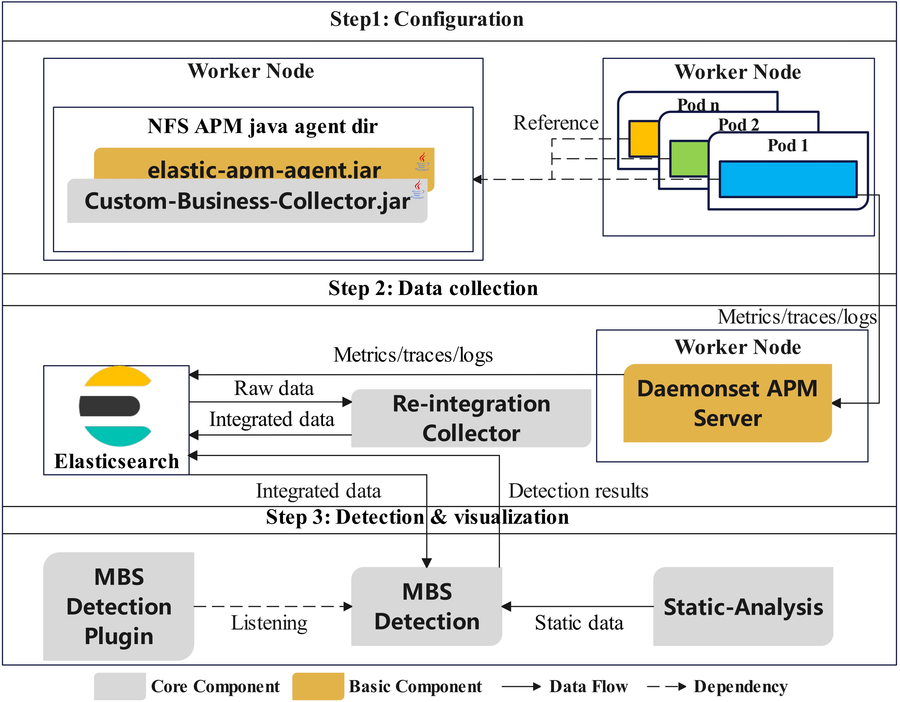

# SmellDoc - Microservice Bad Smell Detection and Analysis Platform

## 📋 Project Overview

SmellDoc is an **Elastic Stack-based microservice bad smell detection and analysis plugin** that combines runtime data (metrics, traces, logs) with static code metrics data to detect and visualize various bad smells, performance issues, and architectural problems in microservice architectures.

> **Core Value:**
> **Step 1 - Configuration Phase:** Deploy agent proxy → Collect runtime data  
> **Step 2 - Data Collection:** Preprocess and integrate metrics data → Send to Elasticsearch  
> **Step 3 - Detection & Visualization:** Bad smell detection → Display in Kibana


1. Re-integration Collector (RIC) - Code location: `service/datacollector/`
2. MBS Detection (BSD) - Code location: `controller/`
3. Custom-Business-Collector (CBC) - Location: [apm-springcloud-business-plugin](https://github.com/yang66-hash/apm-springcloud-business-plugin.git)
4. Kibana MBS Detection Plugin - Location: [kibana-mbs-detection-plugin](https://github.com/yang66-hash/kibana_bad_smell_detection_plugin.git)
5. Microservice System for Demonstration - Location: [PropertyManagementCloud](https://github.com/yang66-hash/PropertyManagementCloud.git)
6. Elastic APM - Location: [elastic apm](https://github.com/elastic/apm.git)
6. Various documentation available in `docs`

## 🏗️ System Architecture

### 1) Configuration Layer
- **Elastic APM Java Agent** (`elastic-apm-agent.jar`) - Collects runtime metrics and trace information
- **Custom Business Collector (CBC)** - Collects business-level metrics and custom monitoring data
- **APM Server** - Real-time receiving, processing and storing data to ES

### 2) Data Collection Layer
- **Re-integration Collector (RIC)** - Deduplicates and aggregates runtime metrics, providing standardized data format
- **Elasticsearch** - Stores all processed monitoring data and detection results

### 3) Detection & Visualization Layer
- **Static Analysis Component** - Extracts static code metrics and architectural information from microservice source code
- **BSD Component** - Fuses static metrics with real-time runtime data for bad smell detection
- **Kibana Plugin** - Monitors BSD status and visualizes bad smell findings and trend analysis

## 🔧 Technology Stack

| Technology | Version | Purpose | Description |
|------------|---------|---------|-------------|
| **Spring Boot** | 3.2.4 | Application Framework | Microservice architecture foundation framework |
| **Java** | 17 | Development Language | Modern Java features support |
| **MySQL** | 8.0 | Relational Database | Metadata and configuration storage |
| **Elasticsearch** | 8.14.3 | Search Engine | Monitoring data and detection results storage |
| **Maven** | 3.6+ | Build Tool | Project build and dependency management |
| **Knife4j** | 4.4.0 | API Documentation | Swagger enhanced documentation tool |
| **JavaParser** | 3.24.2 | Code Analysis | Static code analysis and AST parsing |
| **JGit** | 7.2.0 | Version Control | Git repository operations and analysis |
| **Kubernetes Client** | 20.0.0 | Container Orchestration | K8s cluster management and service discovery |

## 🚀 Core Features

### 🔍 Static Analysis Features (12 Bad Smell Types)

| Detection Type | API Endpoint | Description | Detection Target |
|----------------|--------------|-------------|------------------|
| **Hardcoded Endpoints** | `/com-inter/hardcoded-endpoints` | Detects hardcoded service endpoints | Lack of configuration flexibility, maintenance difficulties |
| **Scattered Functionality** | `/decomposition/scattered-functionality` | Identifies functionality scattered across services | Unclear service boundaries, duplicate implementation |
| **Wrong Service Cuts** | `/decomposition/wrong-cuts` | Detects incorrect service decomposition | Technical layering instead of business function decomposition |
| **Microservice Greedy** | `/decomposition/microservice-greedy` | Identifies services with excessive responsibilities | Violation of single responsibility principle |
| **No API Versioning** | `/api/no-api-versioning` | Detects missing API version control | API compatibility and evolution management |
| **ESB Usage** | `/infrastructure/esb-usage` | Identifies excessive enterprise service bus usage | Over-centralized architecture |
| **No API Gateway** | `/infrastructure/no-api-gateway` | Detects missing API gateway | Architectural design flaws |
| **Hub-like Dependency** | `/infrastructure/hub-like-dependency` | Identifies dependency centralization issues | Single point of failure risk |
| **Shared Libraries** | `/infrastructure/shared-libraries` | Detects problematic shared library usage | Dependency management complexity |
| **Sharing Persistence** | `/infrastructure/sharing-persistence` | Detects multiple services sharing the same database | Data model coupling, service lifecycle binding |
| **Inappropriate Service Intimacy** | `/infrastructure/inappropriate-service-intimacy` | Detects services accessing other services' private data | Lack of independence and autonomy principles |
| **God Component** | `/infrastructure/god-component` | Detects overly large and complex microservices | Service with excessive responsibilities, violating single responsibility principle |

### 📊 Dynamic Analysis Features (12 Bad Smell Types)

#### 1️⃣ Basic Runtime Bad Smell Detection
| No. | API Endpoint | Bad Smell Type | Description | Detection Dimensions |
|-----|--------------|----------------|-------------|---------------------|
| 1 | `POST /dynamic/fragile-service` | Fragile Service | Fragile service detection | Failure rate, latency, throughput |
| 2 | `POST /dynamic/uneven-load-distribution` | Uneven Load Distribution | Uneven load distribution detection | CPU, memory, request count, latency |
| 3 | `POST /dynamic/inconsistent-service-response` | Inconsistent Service Response | Inconsistent service response detection | Latency fluctuation, failure rate changes |

#### 2️⃣ Resource and Performance Bad Smell Detection
| No. | API Endpoint | Bad Smell Type | Description | Detection Dimensions |
|-----|--------------|----------------|-------------|---------------------|
| 4 | `POST /dynamic/call-rate-anomaly` | Call Rate Anomaly | Call rate anomaly detection | Request count changes, historical comparison |
| 5 | `POST /dynamic/uneven-api-usage` | Uneven API Usage | Uneven API usage detection | API call distribution, Gini coefficient |

#### 3️⃣ Database and Query Bad Smell Detection
| No. | API Endpoint | Bad Smell Type | Description | Detection Dimensions |
|-----|--------------|----------------|-------------|---------------------|
| 6 | `POST /dynamic/high-frequency-slow-queries` | High Frequency Of Slow Queries | High frequency slow query detection | Slow query ratio, execution time |

#### 4️⃣ Memory and GC Bad Smell Detection
| No. | API Endpoint | Bad Smell Type | Description | Detection Dimensions |
|-----|--------------|----------------|-------------|---------------------|
| 7 | `POST /dynamic/frequent-gc` | Frequent GC | Frequent GC detection | Four-dimensional GC analysis |
| 8 | `POST /dynamic/long-time-gc` | Long Time GC | Long time GC detection | GC pause time analysis |
| 9 | `POST /dynamic/memory-jitter-of-service` | Memory Jitter Of Service | Memory jitter detection | Memory usage fluctuation |

#### 5️⃣ Logic Processing Bad Smell Detection
| No. | API Endpoint | Bad Smell Type | Description | Detection Dimensions |
|-----|--------------|----------------|-------------|---------------------|
| 10 | `POST /dynamic/uneven-logic-processing` | Uneven Logic Processing | Uneven logic processing detection | Method call distribution |

#### 6️⃣ System Stability Bad Smell Detection
| No. | API Endpoint | Bad Smell Type | Description | Detection Dimensions |
|-----|--------------|----------------|-------------|---------------------|
| 11 | `POST /dynamic/the-ramp` | The Ramp | Ramp effect detection | Performance trend analysis |

#### 7️⃣ Cyclic Dependency Detection
| No. | API Endpoint | Bad Smell Type | Description | Detection Dimensions |
|-----|--------------|----------------|-------------|---------------------|
| 12 | `POST /dynamic/cyclic-dependency` | Cyclic Dependency | Cyclic dependency detection | Call chain cycle analysis |

### 📈 Data Collection and Monitoring

- **Business Metrics Collection** - Collects business-specific metrics and KPI data
- **Internal Metrics Monitoring** - Monitors JVM and application internal performance metrics
- **Trace Collection** - Collects distributed trace data and call chain information
- **API Metrics Monitoring** - Monitors API usage patterns, performance metrics and error rates
- **Real-time Data Caching** - Provides high-performance data caching and fast access

## 📁 Project Structure

```
BSDProject/
├── commons/                                    # Common module
│   ├── src/main/java/com/yang/apm/springplugin/
│   │   ├── base/                               # Base libraries
│   │   │   ├── context/                        # Detection result classes
│   │   │   ├── Enum/                          
│   │   │   ├── item/                          
│   │   │   └── utils/                         
│   │   ├── constant/                          # Constant definitions
│   │   ├── expection/                         # Exception handling
│   │   ├── indexmapping/                      # ES index mapping
│   │   ├── model/                             # Data models
│   │   ├── pojo/                              # Data transfer objects
│   │   └── utils/                             # Common utilities
│   └── pom.xml                                
├── BSDComponent/                              # Main component module
│   ├── src/main/java/com/yang/apm/springplugin/
│   │   ├── BSDComponentApplication.java      
│   │   ├── config/                            # Configuration classes
│   │   │   ├── AsyncConfig.java               # Async configuration
│   │   │   ├── CacheConfig.java               # Cache configuration
│   │   │   └── WebConfig.java                 # Web configuration
│   │   ├── controller/                        # REST API controllers
│   │   │   ├── datacollector/                 # Data collection endpoints
│   │   │   ├── dynamicanalysis/               # Dynamic analysis endpoints
│   │   │   ├── staticanalysis/                # Static analysis endpoints
│   │   │   └── HealthCheckController.java     # Health check
│   │   ├── factory/                           # Factory classes
│   │   ├── listener/                          # Event listeners
│   │   ├── manager/                           # Resource managers
│   │   ├── mapper/                            # Data access layer
│   │   ├── monitor/                           # Monitoring components
│   │   ├── pojo/                              # Data objects
│   │   ├── services/                          # Business logic services
│   │   │   ├── datacollector/                 # Data collection components
│   │   │   ├── dynamicdetect/                 # Dynamic detection services
│   │   │   ├── staticdetect/                  # Static detection services
│   │   │   └── db/                            # Database services
│   │   └── utils/                             # Utility classes
│   ├── src/main/resources/
│   │   ├── application.yml                    # Main configuration file
│   │   ├── application-dev.yml                # Development environment configuration
│   │   ├── application-pro.yml                # Production environment configuration
│   │   └── logback-spring.xml                 # Logging configuration
│   └── pom.xml                                # Main component configuration
├── docs/                                      # Documentation directory
│   ├── cn/                                    # Chinese documentation
│   │   ├── FINAL_COMPLETE_API_LIST.md         # Complete API list
│   │   ├── UnevenApiUsageDetection.md         # Uneven API usage detection
│   │   └── ...                                # Other technical documentation
│   ├── datademo/                              # Data examples
│   │   ├── BusinessMetricsDemo.json           # Business metrics examples
│   │   ├── SvcMetricsResDemo.json             # Service metrics examples
│   │   └── cycleDependencyDemo.json           # Cyclic dependency examples
│   └── img/                                   
│       └── architecture.jpg                   # Architecture diagram
├── pom.xml                                    # Root project configuration
└── README.md                                  # Project documentation
```

## 🚀 Quick Start

### Prerequisites

- **Java 17** or higher
- **Maven 3.6** or higher
- **MySQL 8.0** - Relational database
- **Elasticsearch 8.14.3** - Search engine

### Installation Steps

1. **Clone Repository**
   ```bash
   git clone https://github.com/yang66-hash/BSDProject.git
   cd BSDProject
   ```

2. **Configure Database**
   Import database script `docs/db/data_collector_db.sql` to local MySQL database

3. **Update Configuration**
   Edit `BSDComponent/src/main/resources/application-dev.yml`:
   ```yaml
   server:
     port: 32000
   
   spring:
     datasource:
       username: your_username
       password: your_password
       url: jdbc:mysql://localhost:3306/data_collector_db
     elasticsearch:
       username: elastic
       password: your_elasticsearch_password
       uris: "http://localhost:9200"
   
   mbst:
     repository:
       username: your_git_username
       password: your_git_password
       local-repository: "/path/to/local/repo"
       remote-repositories: "repo1,repo2"
   ```

4. **Build Project**
   ```bash
   mvn clean install
   ```

5. **Run Application**
   ```bash
   cd BSDComponent
   mvn spring-boot:run
   ```

The application will start on the default port 32000. You can also start it using the `java -jar` command.

### API Documentation Access

- **Swagger UI**: http://localhost:32000/doc.html

## 📖 Usage Examples

### Static Analysis Examples

Requires configuration of `mbst.repository` parameters for accessing Git repositories.

#### Detect Hardcoded Endpoints
```bash
curl -X POST http://localhost:32000/com-inter/hardcoded-endpoints \
  -H "Content-Type: application/json" \
  -d '{"serviceName": "user-service"}'
```

#### Detect Scattered Functionality
```bash
curl -X POST http://localhost:32000/decomposition/scattered-functionality \
  -H "Content-Type: application/json" \
  -d '{"serviceName": "order-service"}'
```

### Dynamic Analysis Examples
Requires a microservice system with properly configured APM Java Agent.

#### Detect Uneven Load Distribution
```bash
curl -X POST http://localhost:32000/dynamic/uneven-load-distribution \
  -H "Content-Type: application/json" \
  -d '{"serviceName": "payment-service"}'
```

#### Detect Call Rate Anomaly
```bash
curl -X POST http://localhost:32000/dynamic/call-rate-anomaly \
  -H "Content-Type: application/json" \
  -d '{"serviceName": "user-service"}'
```

#### Detect Frequent GC
```bash
curl -X POST http://localhost:32000/dynamic/frequent-gc \
  -H "Content-Type: application/json" \
  -d '{"serviceName": "order-service"}'
```

## 📈 System Features

### 1. Comprehensive Coverage
- **24 Bad Smell Types**: Covers all major static and runtime bad smell types in microservice architectures
- **Multi-dimensional Analysis**: Comprehensive coverage from basic performance to complex system-level bad smells
- **Intelligent Detection**: Intelligent detection algorithms based on multi-dimensional metrics

### 2. Unified Architecture
- **Standardized Framework**: All detection services adopt the same architectural pattern
- **Unified Data Flow**: ES data retrieval → Instance-level detection → Result aggregation → Cache storage
- **Modular Design**: High cohesion and low coupling modular architecture

### 3. High Performance Design
- **Asynchronous Processing**: Adopts asynchronous processing mechanism, supporting high concurrency access
- **Cache Optimization**: Multi-level cache strategy, improving data access performance
- **Batch Processing**: Batch data writing and detection, improving system throughput

### 4. Complete Lifecycle
- **Real-time Monitoring**: Real-time data collection and anomaly detection
- **Historical Analysis**: Supports historical data comparison analysis
- **Result Storage**: Detection results automatically stored to system cache and ES
- **Process Tracking**: Complete detection process tracking and auditing

## 🎯 Detection Capability Matrix

| Detection Category | Bad Smell Count | Status | Main Functions |
|-------------------|-----------------|--------|----------------|
| **Static Analysis** | 12 | ✅ Complete | Code structure, architectural design detection |
| **Basic Runtime** | 3 | ✅ Complete | Service health, load balancing detection |
| **Resource Performance** | 2 | ✅ Complete | Resource utilization, performance anomaly detection |
| **Database Query** | 1 | ✅ Complete | SQL performance, query optimization detection |
| **Memory GC** | 3 | ✅ Complete | JVM performance, memory management detection |
| **Logic Processing** | 1 | ✅ Complete | Business logic distribution detection |
| **System Stability** | 1 | ✅ Complete | Failure propagation, performance trend detection |
| **Cyclic Dependency** | 1 | ✅ Complete | Call chain cycle detection |
| **Total** | **24** | **✅ 100% Complete** | **Comprehensive Bad Smell Detection** |

## 🤝 Contributing Guidelines

1. Fork the repository
2. Create a feature branch (`git checkout -b feature/AmazingFeature`)
3. Commit your changes (`git commit -m 'Add some AmazingFeature'`)
4. Push to the branch (`git push origin feature/AmazingFeature`)
5. Open a Pull Request

### Code Standards

- Follow Java coding standards
- Add appropriate comments and documentation
- Write unit tests
- Ensure code passes all checks

## 📄 License

This project is licensed under the MIT License - see the [LICENSE](LICENSE) file for details.

## 🆘 Support and Help

### Frequently Asked Questions

**Q: How to adjust detection thresholds?**
A: You can adjust detection thresholds by modifying relevant parameters in the configuration file, such as `coefficient`, `threshold`, etc.

**Q: What databases does the system support?**
A: Currently mainly supports MySQL 8.0 as the relational database, while using Elasticsearch for data storage and retrieval.

**Q: How to add custom detection rules?**
A: Implement the `IDetectConvert` interface, create a new service class, and add corresponding endpoints in the controller.

**Q: What is the system performance?**
A: The system adopts asynchronous processing and caching mechanisms, supporting high concurrency access. Specific performance metrics depend on the deployment environment and data volume.

**Q: How to integrate into existing systems?**
A: The system provides REST API interfaces that can be easily integrated into existing monitoring and alerting systems.

### Getting Help

- 📧 Email: [2019023491@qq.com]
- 📱 DingTalk Group: [Group Number]
- 🐛 Issue Reporting: [GitHub Issues](https://github.com/yang66-hash/BSDProject.git)
- 📚 Documentation: [Project Documentation](docs/)

## 📝 Changelog

### Version 1.0.0 (2025-10-01)
- ✨ Initial version release
- 🔍 **Static Analysis Features** (12 bad smell types)
  - Hardcoded endpoints detection
  - Scattered functionality detection
  - Wrong service cuts detection
  - Microservice greedy detection
  - No API versioning detection
  - ESB usage detection
  - No API gateway detection
  - Hub-like dependency detection
  - Shared libraries detection
  - Sharing persistence detection
  - Inappropriate service intimacy detection
  - God component detection
- 📊 **Dynamic Analysis Features** (12 bad smell types)
  - Fragile service detection
  - Uneven load distribution detection
  - Inconsistent service response detection
  - Call rate anomaly detection
  - Uneven API usage detection
  - High frequency slow queries detection
  - Frequent GC detection
  - Long time GC detection
  - Memory jitter detection
  - Uneven logic processing detection
  - The ramp detection
  - Cyclic dependency detection
- 📈 **Data Collection and Monitoring**
  - Business metrics collection
  - Internal metrics monitoring
  - Trace collection
- 🔌 **REST API Endpoints**
  - 24 detection interfaces
  - Unified request/response format
  - Complete API documentation
- 📖 **Comprehensive Documentation and Examples**
  - Detailed algorithm descriptions
  - Complete usage examples
  - Configuration and deployment guides

### Version 1.1.0 (Planned)
- 🚀 Performance optimization
- 🔧 More detection algorithms
- 📊 Enhanced visualization features
- 🐳 Docker support
- ☸️ Kubernetes integration

---

**SmellDoc** - Making microservice architectures healthier, more efficient, and more maintainable!

> **Core Philosophy**: Through intelligent detection and analysis, help development teams identify and resolve various bad smell issues in microservice architectures, improving system maintainability, performance, and stability.
